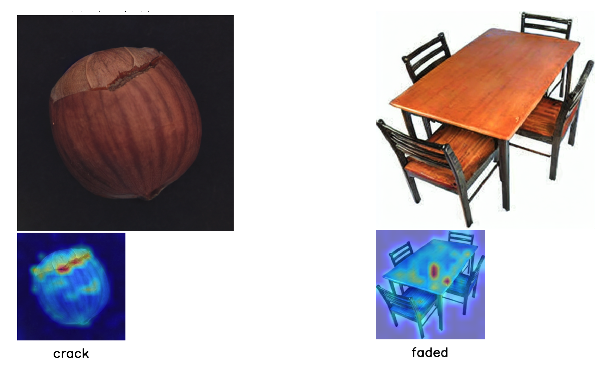

<div align="left">

<br>

## 🌟 News  

🚀 **Code updated with memory optimization!** Now you can run the code on a **24GB GPU** without issues.

<br>
</div>

<div align="center">
<h1>[CVPR 2025] Unseen Visual Anomaly Generation</h1>

<div>
    <a href='https://hansunhayden.github.io/' target='_blank'>Han Sun</a><sup>1</sup>&emsp;
    <a href='https://caoyunkang.github.io/' target='_blank'>Yunkang Cao</a><sup>2</sup>&emsp;
    <a href='https://sites.google.com/view/dong-hao/' target='_blank'>Hao Dong</a><sup>3</sup>&emsp;
    <a href='https://people.epfl.ch/olga.fink?lang=en' target='_blank'>Olga Fink</a><sup>1</sup>
</div>
<div>
    <sup>1</sup>EPFL, <sup>2</sup>HUST, <sup>3</sup>ETH Zurich
</div>


[//]: # (<div>)

[//]: # (    <h4 align="center">)

[//]: # (        • <a href="https://arxiv.org/pdf/2406.01078" target='_blank'>CVPR 2025</a> •)

[//]: # (    </h4>)

[//]: # (</div>)

[[Project page]](https://hansunhayden.github.io/AnomalyAny.github.io/) [[Paper]](https://openaccess.thecvf.com/content/CVPR2025/papers/Sun_Unseen_Visual_Anomaly_Generation_CVPR_2025_paper.pdf)[[Huggingface Demo (coming soon)]](https://arxiv.org/pdf/2406.01078)


[//]: # (<div style="text-align:center">)

[//]: # ()

[//]: # (</div>)

---

</div>


>**Abstract:** Visual anomaly detection (AD) presents significant challenges due to the scarcity of anomalous data samples. 
While numerous works have been proposed to synthesize anomalous samples, these synthetic anomalies often lack authenticity or require extensive training data, limiting their applicability in real-world scenarios.
In this work, we propose **Anomaly Anything** (AnomalyAny), a novel framework that leverages Stable Diffusion (SD)'s image generation capabilities to generate diverse and realistic unseen anomalies. 
By conditioning on a single normal sample during test time,AnomalyAny is able to generate unseen anomalies for arbitrary object types with text descriptions.
Within AnomalyAny, we propose attention-guided anomaly optimization to direct SD’s attention on generating hard anomaly concepts. Additionally, we introduce prompt-guided anomaly refinement, incorporating detailed descriptions to further improve the generation quality. 
Extensive experiments on MVTec AD and VisA datasets demonstrate AnomalyAny's ability in generating high-quality unseen anomalies and its effectiveness in enhancing downstream AD performance.

## 💻 Requirements
- Python 3.7+
- CUDA 11.6+

## 🛠️ Installation
```bash
conda env create -f env.yml
```
You can also build the environment with docker.
<details>
<summary>Docker file</summary>

```
# Getting base ubuntu image with platform specified (important if you build on Apple Silicon)
# FROM --platform=linux/amd64 ubuntu:latest

# ARG BASE_IMAGE=nvidia/cuda:12.1.1-runtime-ubuntu20.04
ARG BASE_IMAGE=nvidia/cuda:11.6.2-cudnn8-devel-ubuntu20.04
FROM ${BASE_IMAGE} as dev-base

# Set environment variables
ENV DEBIAN_FRONTEND=noninteractive

# Installing ssh, rsync, rclone, anaconda, vscode-server
# Here Miniconda3-py39_23.5.2-0-Linux-x86_64.sh should be downloaded from 
# https://docs.conda.io/en/latest/miniconda.html and placed in
# same folder as dockerfile, this image still includes installation of sudo,
# but after applying abovementioned restriction, it will became useless

# Update and install necessary packages
# installing tzdata separately to avoid interactive configuration
# RUN apt-get update && apt-get install -y openssh-server sudo rsync rclone
RUN apt-get update && \
    apt-get install -y openssh-server sudo rsync rclone git tzdata && \
    # todo
    apt-get install ffmpeg libsm6 libxext6 -y && \
    ln -fs /usr/share/zoneinfo/Europe/Zurich /etc/localtime && \
    dpkg-reconfigure --frontend noninteractive tzdata && \
    rm -rf /var/lib/apt/lists/*

# Install Miniconda
RUN wget -O- https://aka.ms/install-vscode-server/setup.sh | sh
RUN wget https://repo.anaconda.com/miniconda/Miniconda3-latest-Linux-x86_64.sh -O /tmp/miniconda_install.sh
RUN bash /tmp/miniconda_install.sh -b -p /usr/local/miniconda3

# Update Conda to the latest version
RUN /usr/local/miniconda3/bin/conda update -n base -c defaults conda

# Build arguments, for 'LDAP_' argument you can find information in your people.epfl.ch page
# admnistrative section, for SSH we recommend using public key instead of password, since it
# is visible in layers description after building

ARG LDAP_USERNAME
ARG LDAP_UID
ARG LDAP_GROUPNAME
ARG LDAP_GID
ARG SSH_PUBLIC_KEY

# Adding user and configuring SSH

RUN echo "${LDAP_USERNAME}  ALL=(ALL) NOPASSWD: ALL" >> /etc/sudoers.d/sshd
RUN mkdir /var/run/sshd
RUN sed 's@session\s*required\s*pam_loginuid.so@session optional pam_loginuid.so@g' -i /etc/pam.d/sshd

RUN groupadd ${LDAP_GROUPNAME} --gid ${LDAP_GID}
RUN useradd -m -U -s /bin/bash -G ${LDAP_GROUPNAME} -u ${LDAP_UID} ${LDAP_USERNAME}
RUN mkdir -p /home/${LDAP_USERNAME}/.ssh
RUN touch /home/${LDAP_USERNAME}/.ssh/authorized_keys
RUN echo ${SSH_PUBLIC_KEY} > /home/${LDAP_USERNAME}/.ssh/authorized_keys
RUN chown ${LDAP_USERNAME}:${LDAP_GROUPNAME} /home/${LDAP_USERNAME}/

RUN mkdir /opt/ssh
RUN ssh-keygen -q -N "" -t dsa -f /opt/ssh/ssh_host_dsa_key
RUN ssh-keygen -q -N "" -t rsa -b 4096 -f /opt/ssh/ssh_host_rsa_key
RUN ssh-keygen -q -N "" -t ecdsa -f /opt/ssh/ssh_host_ecdsa_key
RUN ssh-keygen -q -N "" -t ed25519 -f /opt/ssh/ssh_host_ed25519_key
RUN cp /etc/ssh/sshd_config /opt/ssh/
RUN cat <<EOT >> /opt/ssh/sshd_config
Port 2022
HostKey /opt/ssh/ssh_host_rsa_key
HostKey /opt/ssh/ssh_host_ecdsa_key
HostKey /opt/ssh/ssh_host_ed25519_key
LogLevel DEBUG3
ChallengeResponseAuthentication no
PidFile /opt/ssh/sshd.pid
EOT
RUN chmod 600 /opt/ssh/*
RUN chmod 644 /opt/ssh/sshd_config
RUN chown -R ${LDAP_USERNAME}:${LDAP_GROUPNAME} /opt/ssh/
RUN chown ${LDAP_USERNAME}:${LDAP_GROUPNAME} /etc/systemd/system/sshd.service

EXPOSE 2022

# Configuring Anaconda
USER ${LDAP_USERNAME}
WORKDIR /home/${LDAP_USERNAME}
SHELL ["/bin/bash", "--login", "-c"]
# ENV PATH="/usr/local/anaconda3/bin:$PATH"
ENV PATH="/usr/local/miniconda3/bin:$PATH"

COPY env.yml .
RUN conda env create -f env.yml
RUN conda init bash

SHELL ["conda", "run", "-n", "diffusers", "/bin/bash", "-c"]
SHELL ["/bin/bash", "--login", "-c"]


CMD ["/usr/sbin/sshd", "-D", "-f", "/opt/ssh/sshd_config", "-E", "/tmp/sshd.log"]
```
</details>

## 🖼️ Anomaly Inference

We provide Jupyter notebooks for a complete pipeline to generate anomaly images.

To generate an anomaly image, you need to provide **prompts** and a **normal guidance image** as input:

```python
# Example setup
type = "table"  # Define the object name
prompt = f"a photo of a {type} that is faded"  # Anomaly prompt guidance
tokens = "8"  # Token indice of the anomaly keyword

normal_prompt = f"a photo of a {type}" 
detailed_prompt = f"a photo of a {type} with areas of discoloration or lightening due to prolonged sun exposure"
image_guidance_path = "./example_web/table.jpg"  # Path to normal guidance image

token_indices = get_indices_to_alter_new(stable, prompt, tokens)  # Extract token index from anomaly description
image_guidance = Image.open(image_guidance_path).convert("RGB")
````

We implement the `run_and_display` pipeline to generate the anomaly image. It returns the generated anomaly image and its latent representation, with the guidance and several tunable hyperparameters as its input:

```python
image, image_latent = run_and_display(
    controller=controller,
    generator=g, 
    run_standard_sd=False,
    display_output=True,
    prompts=[prompt],                   # Anomaly prompt guidance
    indices_to_alter=token_indices,     # Token indices of anomaly prompt
    init_image=image_guidance,          # Normal image guidance 
    init_image_guidance_scale=0.25,     # Gamma that controls the starting step
    mask_image=None,                    # Optional mask to localize anomaly region
    scale_factor=50,                    # Controls latent update rate
    normal_prompt=normal_prompt,        # Normal prompt
    detailed_prompt=detailed_prompt     # Detailed anomaly description
)
```

Refer to the provided Jupyter notebooks for complete examples and results:

* `clip_anomaly_generation_mvtec.ipynb`
* `clip_anomaly_generation_web.ipynb`



### Using a Custom Dataset

1. Place your normal images in a folder, e.g. `./my_images/`.
2. Set the guidance paths in the notebooks or scripts:
   ```python
   root_path = "./my_images/"
   image_guidance_path = root_path + "000.png"
   ```
   When using `generate_custom_anomalies.py`, run with `--ok-dir ./my_images`.
3. Craft an anomaly description and select token indices:
   ```python
   token_indices = get_indices_to_alter_new(stable, prompt, tokens)
   ```
4. Generate the anomaly image:
   ```python
   image, _ = run_and_display(
       controller=controller,
       generator=g,
       run_standard_sd=False,
       display_output=True,
       prompts=[prompt],
       indices_to_alter=token_indices,
       init_image=image_guidance,
       init_image_guidance_scale=0.25,
       mask_image=None,
       scale_factor=50,
       normal_prompt=normal_prompt,
       detailed_prompt=detailed_prompt,
   )
   ```

To extract candidate prompts from defect examples automatically:

```bash
python scripts/blip_prompt_clustering.py --image-dir ./defects --num-clusters 5
```
This will save representative prompts to `clustered_prompts.json`.


## 🛠️ Todo List
- [ ] Colab demo.
- [ ] HuggingFace demo.


## 💌 Acknowledgement

Our generation pipeline is based on the [🤗Diffusers](https://github.com/huggingface/diffusers) library, incorporating implementations from [Prompt-to-Prompt](https://github.com/google/prompt-to-prompt/) and [Attend-and-Excite](https://github.com/yuval-alaluf/Attend-and-Excite).
We also adapt implementation from [StyleCLIP](https://github.com/orpatashnik/StyleCLIP) for part of our CLIP loss implementation.

Big thanks to these amazing open-source works!


## 📝 Citation
If you find our work useful in your research please consider citing our paper:

```
@inproceedings{sun2025unseen,
  title={Unseen Visual Anomaly Generation},
  author={Sun, Han and Cao, Yunkang and Dong, Hao and Fink, Olga},
  booktitle={Proceedings of the Computer Vision and Pattern Recognition Conference},
  pages={25508--25517},
  year={2025}
}
```
